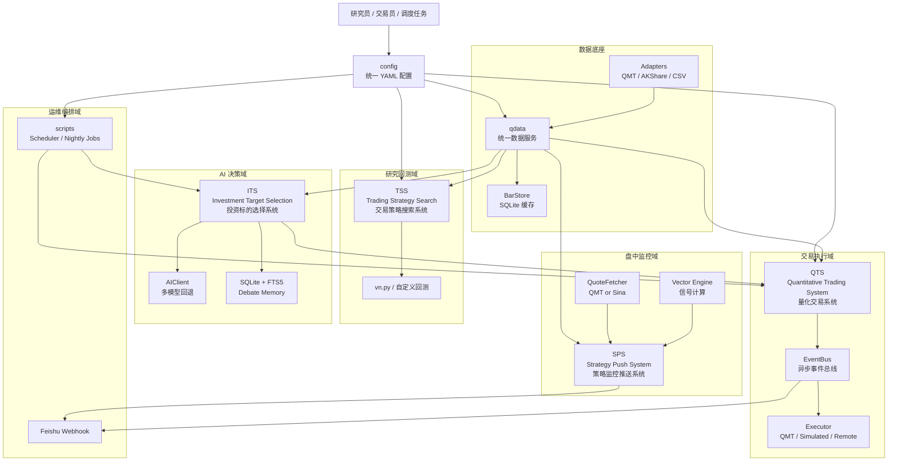

# QMT 系统代码架构分析

> 日期: 2026-04-06
> 分析范围: `qss/`, `sps/`, `tss/`, `qdata/`, `its/`, `config/`, `scripts/`, `tests/`
> 统计口径: 已排除 `.git/`, `.venv/`, `__pycache__/`, `.pytest_cache/`, `tss/output/` 等生成内容
> 命名说明: 对外交付物中使用 **QTS** 作为交易执行主系统简称；当前代码目录与 import 路径仍保持为 `qss/`

## 1. 核心模块缩写与全称

| 缩写 | 英文全称 | 中文全称 | 当前职责 |
|---|---|---|---|
| **QTS** | **Quantitative Trading System** | **量化交易系统** | 在线策略执行、风控、事件总线、执行器、API |
| **SPS** | **Strategy Push System** | **策略监控推送系统** | 盘中监控、状态观察、消息推送 |
| **TSS** | **Trading Strategy Search** | **交易策略搜索系统** | 策略研究、批量回测、策略比较 |
| **ITS** | **Investment Target Selection** | **投资标的选择系统** | 个股筛选、辩论评审、金股池与记忆沉淀 |

> 说明: `ITS` 在当前代码里同时承载“投资决策评审 / 标的筛选”语义。本文统一采用 `Investment Target Selection` 这一主命名，并保留其“评审式筛选”定位。

## 2. 子系统原始定位与边界

这一节补回原有文档中的“角色定位”，避免只看技术实现而忽略业务边界。

| 模块 | 原始定位 | 边界说明 |
|---|---|---|
| **QTS** | 交易执行主系统 | 负责策略执行、风控、订单/成交/持仓闭环，是唯一直接承担交易执行职责的核心子系统。 |
| **SPS** | 监控推送系统 | 负责低频监控、盘中观察和消息推送，**只推不交易**，不直接对接真实下单。 |
| **TSS** | 策略搜索与回测系统 | 负责策略研究、回测、比较和实验，不承担在线实盘执行。 |
| **ITS** | 投资标的筛选与评审系统 | 负责“看什么、评什么”，输出候选股名单与评审结论，**不直接输出最终交易执行闭环**。 |

## 3. 执行摘要

QMT 当前不是单一“交易程序”，而是一个围绕量化交易构建的 **多模块工作区**。它由 5 条主业务链路组成:

1. `qdata/`: 统一数据网关与本地缓存层
2. **QTS (Quantitative Trading System, 量化交易系统)**: 事件驱动的交易执行与策略运行层
3. **SPS (Strategy Push System, 策略监控推送系统)**: 盘中监控与信号观察层
4. **TSS (Trading Strategy Search, 交易策略搜索系统)**: 策略研究、批量回测与策略比较层
5. **ITS (Investment Target Selection, 投资标的选择系统)**: AI 辅助分析、辩论决策、金股池与记忆层

从代码现状看，系统已经形成了较清晰的“数据 -> 信号 -> 风控 -> 执行 / 通知”主干，也开始向“研究环境跨平台、执行环境 Windows/QMT 专属”的双层部署方向演进。`qss/executor/remote_executor.py` 已经体现出这种拆分思路。

同时，代码库也存在典型的工作区型问题:

- 旧文档命名与实际目录存在漂移
- `qss` 仍包含较多 `sys.path` 注入与全局单例
- 部分能力是“可选依赖驱动”的，运行形态依赖本机环境
- `its -> qss` 联动已有接口，但仍属于半集成状态

整体判断: **这不是一个松散脚本集合，而是一个正在平台化的量化交易工作区**。如果继续沿“统一数据层 + 策略执行层 + AI 决策层 + 调度编排层”方向收敛，可以演化为稳定的量化研发与交易平台。

## 4. 代码库概况

按清洗后的代码统计口径，当前核心 Python 文件约 `164` 个，分布如下:

| 模块 | 文件数 | 角色定位 |
|---|---:|---|
| **QTS** | 57 | 实盘/模拟执行、策略运行、风控、API |
| **TSS** | 36 | 策略研发、批量回测、vn.py 对接 |
| **ITS** | 20 | AI 辩论、情绪分析、记忆系统、金股池 |
| `qdata` | 17 | 多数据源适配、统一数据模型、SQLite 缓存 |
| `tests` | 17 | API、指标、异步数据、AI Harness、端到端穿刺 |
| **SPS** | 11 | 盘中监控、状态机、波段计算、实时行情 |
| `scripts` | 3 | 环境校验、定时调度、夜间任务 |
| `config` | 2 | YAML 配置装载与路径统一 |

## 5. 系统定位

从职责划分上，QMT 更适合作为一个“量化工作台”，而不是一个单独服务。结合原始定位，它的边界可以总结为:

- **QTS** 负责“做”: 执行、风控、交易状态闭环
- **SPS** 负责“看”: 观察、提醒、推送，但不下单
- **TSS** 负责“试”: 研究、回测、对比、验证
- **ITS** 负责“挑”: 从全市场筛选值得关注和进一步操作的标的

它兼顾了四类场景:

### 5.1 研究场景

- 批量拉取历史数据
- 使用 `vn.py` 或自定义回测器比较策略
- 输出比较报告、任务清单、候选策略结果

对应模块: `qdata`, **TSS**, `config`

### 5.2 盘中观察场景

- 拉取实时行情
- 计算波段、趋势、异动
- 发出提示和监控信息

对应模块: **SPS**, `qdata`

### 5.3 交易执行场景

- 启动策略
- 订阅事件
- 做风控验证
- 发送委托到 QMT 或模拟执行器
- 提供 API 和可视化面板

对应模块: **QTS**, `qdata`, `config`

### 5.4 AI 决策辅助场景

- 把技术面、基本面、情绪面拆成隔离上下文
- 用多 Agent 辩论形成操作建议
- 把结论写入记忆库 / 金股池
- 为后续交易或观察环节提供候选输入

对应模块: **ITS**, `qss/llm`, `qdata`

## 6. 当前高层架构

## 7. 模块分析

### 7.1 `config/` — 统一配置层

核心职责:

- 统一 YAML 加载入口
- 统一数据路径、股票池、账户、策略参数
- 通过 `QMT_DATA` 等环境变量覆盖路径

关键文件:

- `config/loader.py`
- `config/base.yaml`
- `config/strategies.yaml`
- `config/accounts/*.yaml`

架构作用:

- 为 `qdata`, **QTS**, **TSS** 提供统一根配置
- 降低各模块对本地路径和环境差异的耦合

### 7.2 `qdata/` — 统一数据网关

核心职责:

- 定义统一数据模型 `UnifiedBar`
- 通过 `QMTAdapter`, `AKShareAdapter`, `CSVAdapter` 屏蔽底层数据源差异
- 通过 `BarStore` 把行情缓存到 SQLite
- 通过 `DataService` 实现优先级降级与批量获取
- 通过 `AsyncDataService` 实现多源并发竞速

这层是整个系统的“共享基础设施”。**QTS / SPS / TSS / ITS** 都依赖它提供统一历史数据能力。

设计亮点:

- 数据模型统一，减少上层条件分支
- 支持本地 CSV / QMT / AKShare 多源降级
- 异步服务用 `FIRST_COMPLETED` 竞争源，提高可用性

架构价值:

- 使“研究环境跨平台”成为可能
- 把 Windows/QMT 专属依赖收敛到适配器层

### 7.3 **QTS — Quantitative Trading System（量化交易系统）**

这是当前最接近“交易内核”的模块，包含 6 个子层:

1. `config/`: 配置整合与运行参数
2. `core/`: 数据入口、事件总线、信号处理、通知桥接
3. `strategy/`: 策略基类与多个策略实现
4. `risk/`: 风控与投资组合快照抽象
5. `executor/`: 执行器抽象与 QMT/模拟/远程执行实现
6. `api/`: FastAPI 状态查询与 Dashboard

主启动链路:

`main.py` -> `ConfigManager.load()` -> `DataFeed` -> `Executor` -> `RiskManager` -> `SignalProcessor` -> 策略实例 -> `FastAPI`

关键架构特征:

- `EventBus` 把策略、执行、通知解耦
- `SignalProcessor` 把信号审批与委托落地串起来
- `ExecutorBase` 让 QMT 实盘、模拟盘、远程执行共用统一接口
- `RemoteExecutor` 说明系统已经在向“策略层/执行层分离”演进

原始定位补充:

- **QTS** 是整套体系里最明确的“交易执行主系统”
- 它负责把策略信号转化为风控后可执行的交易动作
- 当 `ITS` 或 `TSS` 输出结果时，只有进入 **QTS** 才真正进入交易闭环

### 7.4 **SPS — Strategy Push System（策略监控推送系统）**

**SPS** 的目标不是下单，而是“高频观察 + 状态判断 + 告警”。

内部四层比较清晰:

1. `data_adapter.py`: 统一历史数据 + 实时行情入口
2. `async_fetcher.py`: 异步网络抓取补充
3. `vector_engine.py`: 波段状态与信号计算
4. `wave_monitor.py`: 状态机与控制器

特点:

- 更偏异步循环与内存状态管理
- 可在没有 QMT 的环境中退化到 Sina 实时行情
- 与 **QTS** 的关系偏“并行能力”，不是主从依赖

原始定位补充:

- **SPS** 的业务本质是“监控 + 推送”
- 原文强调它是低频监控与消息推送系统，**不对接交易**
- 因此它更像雷达和提醒器，而不是执行器

### 7.5 **TSS — Trading Strategy Search（交易策略搜索系统）**

**TSS** 负责把策略想法沉淀为可比较的研究成果，主要包括:

- 统一加载日线数据给 `vn.py`
- 批量回测任务构建与执行
- 多策略对比输出
- 研究输出文件与候选清洗结果

从代码现状看，**TSS** 同时支持两套回测路径:

- `tss/data_loader.py`: 使用 `qdata` 作为统一历史数据入口
- `tss/vnpy_backtest_runner.py`: 在 `vn.py` 环境下运行组合回测

这意味着研究层已经与交易层适度解耦，属于比较成熟的“策略实验区”。

原始定位补充:

- **TSS** 的核心定位是“策略搜索 + 回测”
- 它负责找到哪些策略有效，而不是负责在线交易执行
- 它输出的是策略配置、回测结果和比较结论

### 7.6 **ITS — Investment Target Selection（投资标的选择系统）**

**ITS** 是这个仓库最有辨识度的一层。它不是简单的 LLM 包装，而是分成多个子域:

- `debate/`: 多视角辩论引擎
- `news/`: 新闻抓取与评分
- `sentiment/`: 情绪分析
- `memory/`: 辩论结果与反思记忆
- `golden_pool.py`: 可被 **QTS** 消费的候选池
- `screener.py`: 筛选器与候选生成

其核心设计思想是“维度隔离”: 技术面、基本面、情绪面分别构建 prompt，上层仲裁器只消费各维度结论，而不直接看到全部原始上下文。

这层在架构上充当两种角色:

- 决策增强器: 提供 BUY/HOLD/WATCH 等辅助结论
- 知识沉淀器: 通过 SQLite + FTS5 记录历史辩论与反思

原始定位补充:

- **ITS** 的使命是“从全市场中筛选值得操作的个股”
- 它输出的是候选股名单和评审报告，而不是直接下单指令
- 从职责分离角度看，**ITS** 负责“看和评”，**QTS** 负责“做”

## 8. 关键端到端流程

### 8.1 历史研究与回测流程

1. **TSS** 从 `config` 读取池子与时间范围
2. `tss/data_loader.py` 通过 `qdata.DataService` 加载历史数据
3. 回测器执行策略并输出指标
4. 结果写入 `tss/output/` 报表目录

### 8.2 实盘 / 模拟执行流程

1. **QTS** 的 `main.py` 装载配置与策略
2. `qss/core/data_feed.py` 连接 `qdata` 和可选 `xtdata`
3. 策略在 `EventBus` 上发布 `TradeSignal`
4. `SignalProcessor` 调用 `RiskManager` 审批
5. 审批通过后交给 `Executor` 下单
6. 事件继续分发到通知桥、API 状态层等消费者

### 8.3 盘中监控流程

1. **SPS** 的 `wave_monitor.py` 装载自选列表
2. `QuoteFetcher` 获取实时行情
3. `vector_engine.py` 计算红绿波段与启动信号
4. 状态变化触发缓存刷新或外部通知

### 8.4 AI 辅助筛选流程

1. **ITS** 的 `debate/context_builder.py` 组装技术/基本面/情绪上下文
2. `DebateEngine` 通过 `AIClient` 驱动多个角色模型
3. 仲裁输出保存到 `memory/store.py`
4. `golden_pool.py` 将 BUY/HOLD 标的写入池子，并向 `EventBus` 发布事件
5. 后续可被 **QTS** 作为候选输入消费

## 9. 部署视角

### 9.1 当前可运行拓扑

- Mac / Linux:
  - `qdata` 可通过 AKShare / CSV 工作
  - **SPS** 可通过 Sina / AKShare 降级工作
  - **TSS** 可完成大部分研究与回测
  - **ITS** 可完成 AI 分析与记忆落库
  - **QTS** 可在模拟执行器模式下运行

- Windows + QMT:
  - 可启用 `xtdata`
  - 可启用 `QMTExecutor`
  - 可接近真实实盘交易环境

### 9.2 推荐演进拓扑

建议把系统收敛为双层部署:

1. 策略与研究层（Mac / Linux）
   - **TSS**, **ITS**, **SPS**, 大部分 **QTS**
2. 执行层（Windows + QMT）
   - `QMTExecutor`, `xtdata`, 券商连接

中间通过 `RemoteExecutor` 风格协议连接。这样可以保留现有跨平台研发效率，同时避免把研究环境强绑定到 Windows/QMT。

## 10. 主要架构决策与取舍

### ADR-01: 使用统一数据模型而不是业务层直连多个数据源

- 决策: 由 `qdata` 统一抽象 `UnifiedBar`, `BarQuery`, `DataService`
- 收益: 上层模块无需感知 QMT / AKShare / CSV 差异
- 代价: 适配器层复杂度上升

### ADR-02: 使用事件总线解耦信号处理与执行

- 决策: **QTS** 的 `qss/core/event_bus.py` 作为发布订阅骨架
- 收益: 策略、风控、通知、桥接器可独立扩展
- 代价: 事件边界与状态可观测性需要额外治理

### ADR-03: 执行器抽象优先于券商 SDK 直连

- 决策: 通过 `ExecutorBase` 隔离真实下单与模拟下单
- 收益: 可测试、可回放、可远程
- 代价: 需要维护统一接口的一致性

### ADR-04: AI 辩论采用“维度隔离”而不是一次性大 prompt

- 决策: **ITS** 采用 `technical / fundamental / sentiment / arbiter` 分阶段调用
- 收益: 降低跨域污染，便于测试 Harness Blind Spot
- 代价: 调用链更长，成本更高

## 11. 当前风险与缺口

### 10.1 文档与代码命名漂移

根目录旧文档仍保留历史命名，例如 `stock-qdata`, `search_essential`, `wavemonitor` 等，而实际目录已落为 `qdata`, **TSS**, **SPS**。这会直接影响新成员理解和对外汇报材料的一致性。

### 10.2 模块间仍存在路径注入与隐式导入

**QTS**, **SPS**, `scripts/scheduler.py` 等仍有显式 `sys.path` 操作。这说明包边界虽然正在形成，但还没有完全固化为稳定的可安装包体系。

### 10.3 运行形态依赖本地环境

`fastapi`, `vnpy`, `xtquant`, `akshare`, `aiohttp` 等均是可选或环境敏感依赖。系统能力会因为运行机器不同而表现出不同子集。

### 10.4 `ITS -> QTS / SPS` 消费契约仍未完全标准化

`ITS` 与 **QTS** / **SPS** 保持弱耦合本身是合理设计: `ITS` 负责筛选与评审，**QTS** 负责执行，**SPS** 负责监控与推送，**TSS** 在研究/回测场景下也可以使用更大的股票池。当前真正的缺口不是“耦合太弱”，而是 `ITS` 输出给下游系统的候选池分层、信号语义、准入条件和消费方式还没有完全固化为统一契约。

### 10.5 运维入口未完全统一

当前启动入口分散在:

- `qss/main.py`
- `sps/wave_monitor.py`
- `tss/*runner.py`
- `scripts/scheduler.py`

这对个人工作区很灵活，但对团队化运行、部署和观测不够友好。

## 12. 建议的目标架构

建议把 QMT 收敛为 4 层平台:

1. 基础设施层
   - `config`, `qdata`, logging, storage, scheduler
2. 交易运行层
   - **QTS**, executor, risk, api
3. 研究与监控层
   - **TSS**, **SPS**
4. 智能增强层
   - **ITS**, LLM, memory, golden_pool

目标接口建议:

- `qdata` 提供唯一行情/基本面读取接口
- **QTS** 提供唯一信号执行接口
- **ITS** 输出标准化候选池与建议信号
- **TSS** 输出标准化研究结果与策略评分
- **SPS** 输出标准化实时观察事件

## 13. 推荐实施顺序

### 阶段 1: 文档与边界统一

- 统一所有对外文档命名
- 明确 `qdata / QTS / SPS / TSS / ITS` 五大模块边界
- 明确当前和目标部署拓扑

### 阶段 2: 包边界硬化

- 逐步去除 `sys.path` 注入
- 为 **QTS**, **SPS**, **TSS**, **ITS** 增加更清晰的安装与入口方式
- 把跨模块调用尽量收敛到显式接口

### 阶段 3: 事件与候选池标准化

- 统一 `Signal`, `WatchEvent`, `ResearchResult`, `GoldenPoolEntry` 模型
- 让 **SPS / ITS / TSS** 能输出统一格式，被 **QTS** 消费

### 阶段 4: 运行面一体化

- 抽出单一控制台或 API Gateway
- 统一启动、停止、健康检查、日志采集
- 完成策略层 / 执行层远程分离

## 14. 结论

QMT 当前的真实架构可以概括为:

- `qdata` 是数据底座
- **QTS** 是交易执行核心
- **SPS** 是盘中监控雷达
- **TSS** 是策略实验室
- **ITS** 是 AI 决策增强层
- `scripts` 是运行编排层

它已经具备平台雏形，下一步最值得投入的不是“再加一个策略”，而是把模块边界、事件契约和部署拓扑继续固化。这样未来无论是接更多策略、更多 AI Agent，还是转成团队协作项目，成本都会显著下降。
