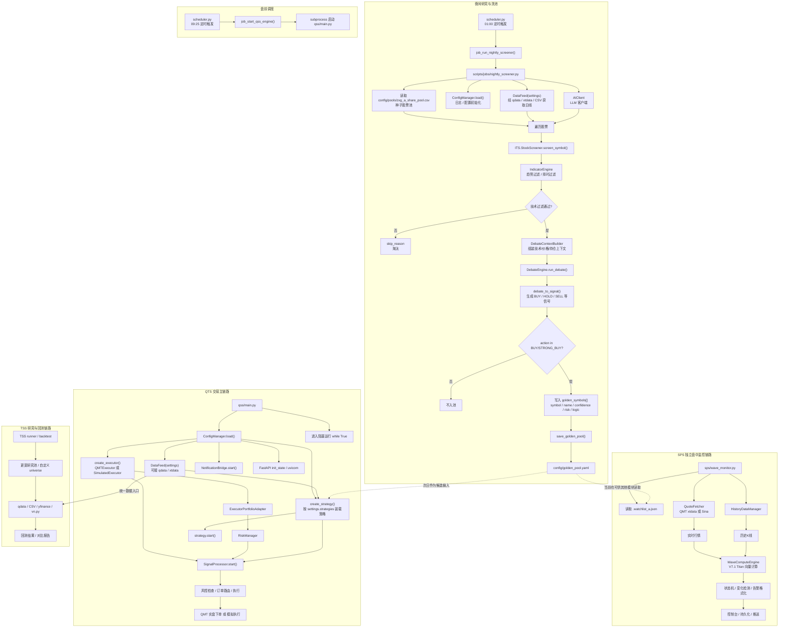
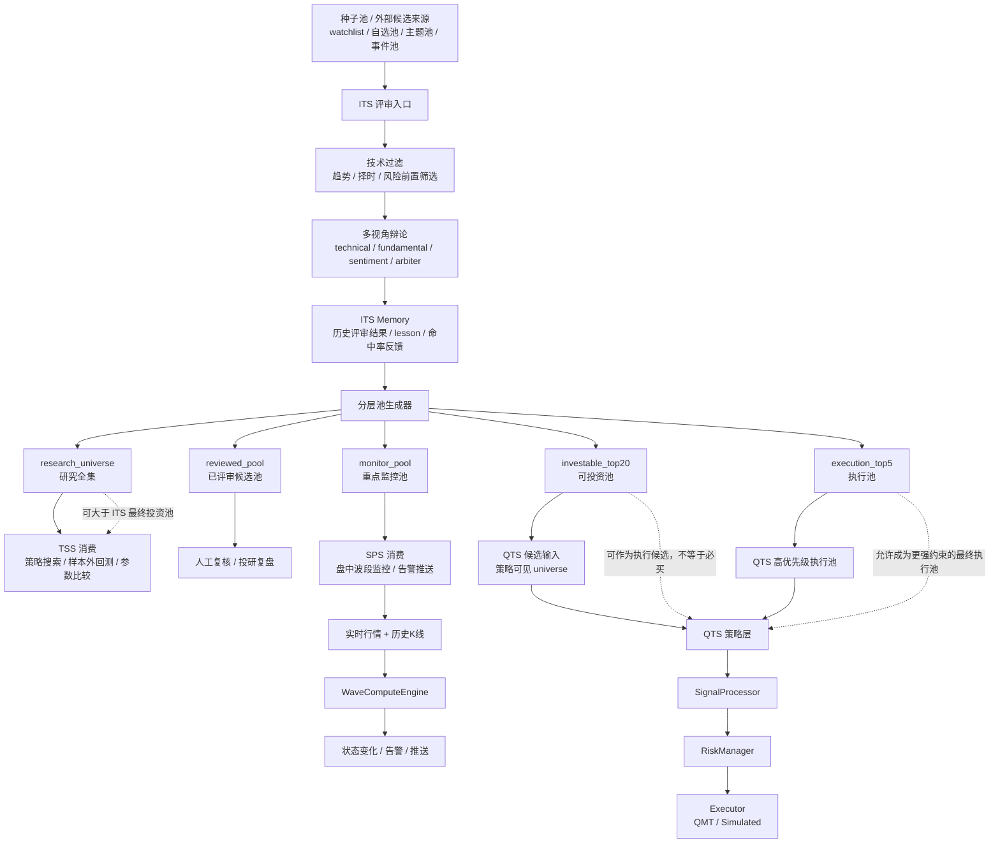

# QMT Detailed Runtime Flow

> 时间: 2026-04-07
> 目的: 画清楚 `ITS / QTS / SPS / TSS / qdata / scheduler` 的详细运行流程
> 说明: 本文分为两部分
> 1. 当前代码真实运行流程
> 2. 推荐演进后的分层池消费流程

## 1. 当前代码真实运行流程

### 1.1 运行说明

当前仓库里，最稳定、最清晰的主流程是:

1. 夜间由 `scheduler.py` 拉起 `nightly_screener.py`
2. `nightly_screener.py` 从种子池读取股票列表
3. `ITS` 用技术过滤 + AI 辩论筛出可关注标的
4. 结果写入 `config/golden_pool.yaml`
5. 次日 `scheduler.py` 拉起 `qss/main.py`
6. `QTS` 加载配置、数据源、执行器、风控和策略后进入交易时段运行
7. `SPS` 当前是相对独立的盘中监控链路，更多消费自己的 watchlist，而不是统一消费 `ITS` 分层池

### 1.2 详细运行流程图

## 2. 当前流程的关键结论

- 当前最明确的“日切换”主线是 `scheduler -> nightly_screener -> golden_pool.yaml -> qss/main.py`
- `ITS` 已经承担了夜间评审和洗池职责
- `QTS` 是唯一真正承担执行闭环的系统
- `SPS` 目前更像并行监控服务，还没有完全切到统一的 `ITS` 输出契约
- `TSS` 保留更宽研究池是合理的，不必被 `ITS` 完全约束

## 3. 推荐演进后的详细运行流程

### 3.1 演进目标

你前面提的方向我认可，推荐把 `ITS` 定义为“分层池生产者”，而不是“强耦合驱动所有下游”的控制中心。

也就是说:

- `ITS` 负责评审和分层
- `QTS` 负责执行
- `SPS` 负责监控和推送
- `TSS` 负责研究和回测

真正需要统一的是“池对象”和“消费契约”。

### 3.2 推荐分层池消费流程图

## 4. 推荐解读口径

如果要在文档或汇报里一句话解释这张图，我建议这样说:

`ITS 负责把更大的候选股票宇宙评审成分层股票池，TSS 负责研究验证，SPS 负责盘中监控，QTS 只消费适合进入交易闭环的那一部分池子。`

## 5. 相关代码入口

- [nightly_screener.py](/Users/james/code/qmt/qmt/scripts/jobs/nightly_screener.py)
- [scheduler.py](/Users/james/code/qmt/qmt/scripts/scheduler.py)
- [main.py](/Users/james/code/qmt/qmt/qss/main.py)
- [wave_monitor.py](/Users/james/code/qmt/qmt/sps/wave_monitor.py)
- [screener.py](/Users/james/code/qmt/qmt/its/screener.py)
- [golden_pool.py](/Users/james/code/qmt/qmt/its/golden_pool.py)
