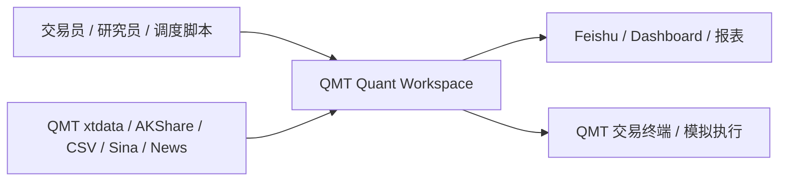
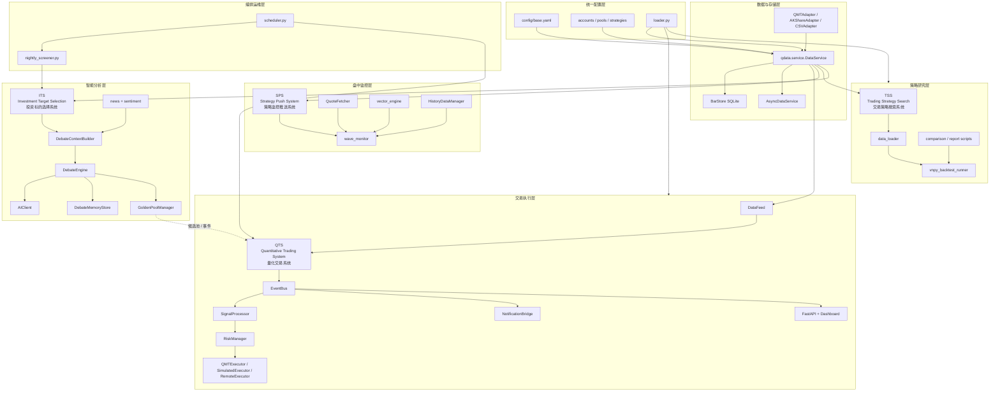
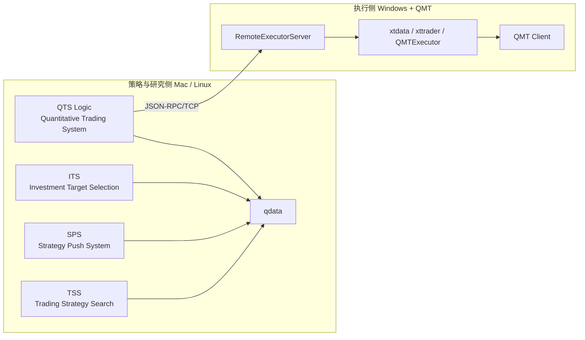

# QMT 高层架构图

> 日期: 2026-04-06
> 说明: 本文档基于当前代码结构绘制，不沿用旧命名。
> 命名说明: 对外简称采用 **QTS**；当前代码目录与 import 路径仍为 `qss/`

## 1. 模块缩写与全称

| 缩写 | 英文全称 | 中文全称 |
|---|---|---|
| **QTS** | **Quantitative Trading System** | **量化交易系统** |
| **SPS** | **Strategy Push System** | **策略监控推送系统** |
| **TSS** | **Trading Strategy Search** | **交易策略搜索系统** |
| **ITS** | **Investment Target Selection** | **投资标的选择系统** |

## 2. 原始定位补充

- **QTS**: 交易执行主系统，负责真正的策略执行、风控与交易闭环
- **SPS**: 监控推送系统，负责低频监控和消息推送，**只推不交易**
- **TSS**: 策略搜索与回测系统，负责研究、验证和比较
- **ITS**: 投资标的筛选与评审系统，负责候选股筛选与评审，**看和评，不直接做**

## 3. 系统上下文图

## 4. 当前代码高层架构图

## 5. 推荐部署图

## 6. 阅读说明

- `qdata` 是全系统共享底座
- **QTS** 是最核心的在线执行域，也是唯一承担交易执行闭环的主系统
- **SPS** 与 **TSS** 分别承担监控和研究职责，其中 **SPS** 只推不交易
- **ITS** 负责智能分析、候选池沉淀和评审结论输出
- `scripts` 负责日常编排，不直接承载业务逻辑
